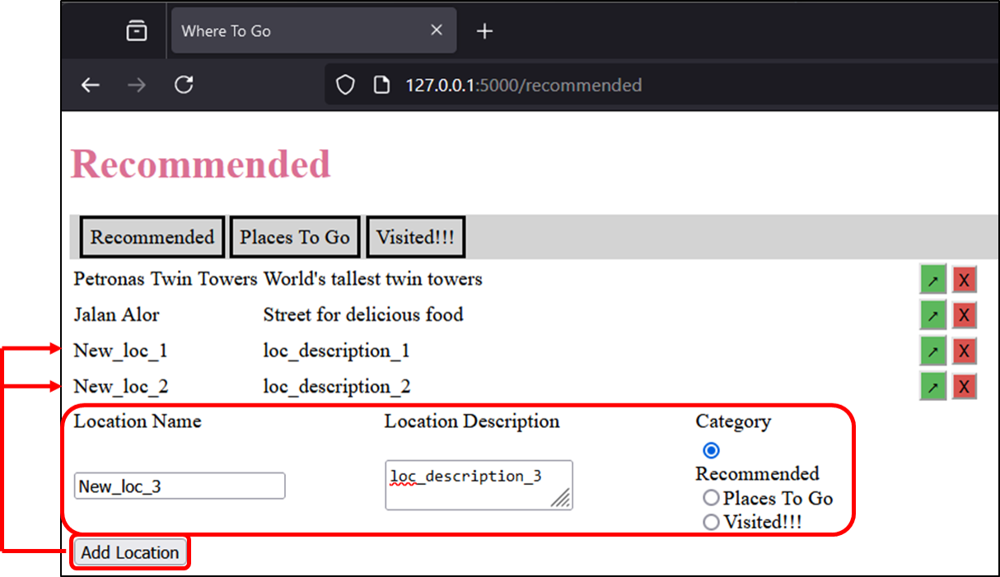

# Quick Start
* Clone the repository
* Create a virtual environment from root (`python -m venv venv`)
* Activate it (`venv/Scripts/activate`)
* Install packages (`pip install -r requirements.txt`)
* Run the `app.py` file (`python sources/tourist-attraction/app.py`)

# Description
Little project to start to learn `Flask` framework.  
This project allow to see list of destination of three categories ("recommended", "places to go" and "visited").    
It also allow to add destination, change category of a destination, or remove a destination, using `POST` requests.  

# Overview

# Architecture
* app.py - **`Launcher`** containing the routes
* locations.py - contains the "Location" object (& methods)
* data.csv - mock the data
* forms.py - contains forms for `Flask`
* *.html - contains the `Jinja` templates (`HTML` files)
* *.css - contains the style (`CSS` file)

# Available routes
* `@app.route('/<category>')`
* `@app.route('/add_location')` -> `POST` request