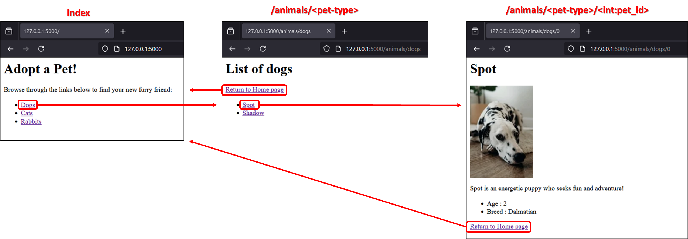

# Quick Start

* Clone the repository
* Create a virtual environment from root (`python -m venv venv`)
* Activate it (`venv/Scripts/activate`)
* Install packages (`pip install -r requirements.txt`)
* Run the `app.py` file (`python sources/adopt-pet/app.py`)

# Description
Little project to start to learn `Flask` framework.
Only two files are used :
* app.py - contains 3 routes, with `HTML` hard written (compliant to `Jinja` format)
* helper.py - contains the data

# Overview


# Available routes
* `@app.route('/')`
* `@app.route('/animals/<pet_type>')`
* `@app.route('/animals/<pet_type>/<int:pet_id>')`

# Concepts learned
Basic demonstration of following concepts :
* Import Flask package and run Flask application
```python
from flask import Flask
app = Flask(__name__)
```
* Define routes for handling requests sent from various URLs
```python
@app.route('/')
def home():
    return '<h1>Hello, World!</h1>'
```
* Create variable rules to handle dynamic URLs
```python
@app.route('/orders/<user_name>/<int:order_id>')
def orders(user_name, order_id):
    return f'<p>Fetching order #{order_id} for {user_name}.</p>'
```
