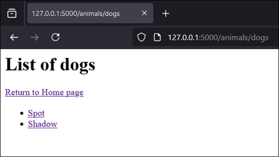
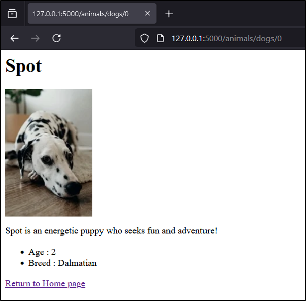

# Quick Start

* Clone the repository
* Create a virtual environment from root (`python -m venv venv`)
* Activate it (`venv/Scripts/activate`)
* Install packages (`pip install -r requirements.txt`)
* Run the `app.py` file (`python sources/adopt-pet/app.py`)

# Description
Little project to start to learn `Flask` framework.
Only two files are used :
* app.py - contains 3 routes, with `HTML` hard written (compliant to `Jinja` format)
* helper.py - contains the data

# Details
### First route `@app.route('/')`
Main page (index), allowing to select a pet type.  


Powered by this snippet :
```python
@app.route('/')
def index():
    return f'''
    <h1>Adopt a Pet!</h1>
    <p>Browse through the links below to find your new furry friend:</p>
    <ul>
      <li><a href="/animals/dogs">Dogs</a></li>
      <li><a href="/animals/cats">Cats</a></li>
      <li><a href="/animals/rabbits">Rabbits</a></li>
    </ul>
    '''
```

### Second route `@app.route('/animals/<pet_type>')`
After have selected a pet type, this page allow to select a pet. 


Powered by this snippet :
```python
@app.route('/animals/<pet_type>')
def animals(pet_type):
    html = f'''
    <h1>List of {pet_type}</h1>
    <a href="/">Return to Home page</a>
    <ul>
    '''
    for idx, pet in enumerate(pets[pet_type]):
      html += f'<li><a href="/animals/{pet_type}/{idx}">{pet['name']}</a></li>'

    html += '</ul>'
    return html
```

### Third route `@app.route('/animals/<pet_type>/<int:pet_id>')`
After have selected a pet, this page allow to see some details on the selected pet. 


Powered by this snippet :
```python
@app.route('/animals/<pet_type>')
def pet(pet_type, pet_id):
    pet = pets[pet_type][pet_id]
    html = f'''
        <h1>{pet['name']}</h1>
        
        <p>{pet['description']}</p>
         <ul>
          <li>Age : {pet['age']}</li>
          <li>Breed : {pet['breed']}</li>
        </ul>
        <a href="/">Return to Home page</a>
        '''
    return html
```
