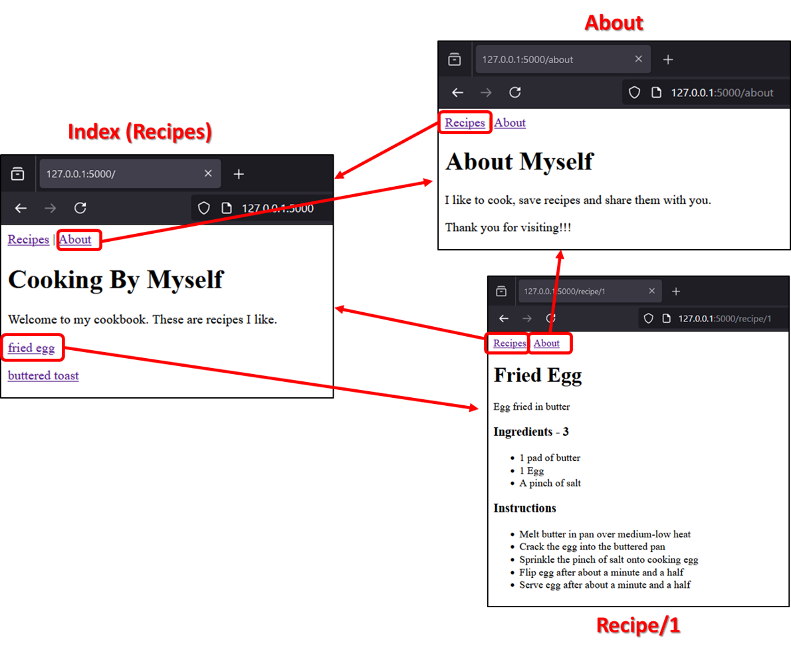

# Quick Start
* Clone the repository
* Create a virtual environment from root (`python -m venv venv`)
* Activate it (`venv/Scripts/activate`)
* Install packages (`pip install -r requirements.txt`)
* Run the `app.py` file (`python sources/cooking-by-myself/app.py`)

# Description
Little project to start to learn `Flask` framework.
Only three files type are used :
* app.py - contains 3 routes
* helper.py - mock the data
* *.html - contains the `Jinja` templates (`HTML` files)

# Overview

# Available routes
* `@app.route('/')`
* `@app.route('/about')`
* `@app.route('/recipe/<int:id>')`

# Concepts learned
* `Flask` function `render_template()`
* `Flask` & `Jinja` templates variable
* `Jinja` variable filters
* `Jinja` "if" statements
* `Jinja` "for" loops
* `Jinja` inheritence