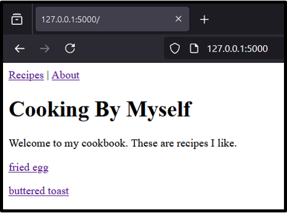
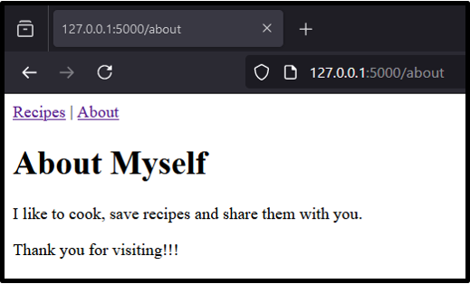
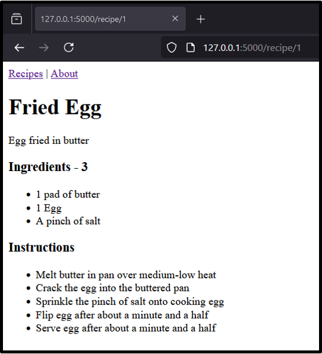

# Quick Start

* Clone the repository
* Create a virtual environment from root (`python -m venv venv`)
* Activate it (`venv/Scripts/activate`)
* Install packages (`pip install -r requirements.txt`)
* Run the `app.py` file (`python sources/cooking-by-myself/app.py`)

# Description
Little project to start to learn `Flask` framework.
Only three files type are used :
* app.py - contains 3 routes
* helper.py - contains the data
* *.hmtl - contains the `Jinja` templates (`HTML` files)

# Details
### Route - Index `@app.route('/')`
Main page (index), allowing to select a recipe.    


Powered by this snippet :
```python
def index():
  return render_template("index.html", template_recipes=recipes)
```

### Route - About `@app.route('/about')`
Some "About" information.  


Powered by this snippet :
```python
def about():
  return render_template("about.html")
```

### Route - Recipe `@app.route("/recipe/<int:id>")`
After have selected a recipe, this page allow to see some details on the selected recipe.  


Powered by this snippet :
```python
@app.route("/recipe/<int:id>")
def recipe(id):
  return render_template("recipe.html", template_recipe=recipes[id], template_description=descriptions[id], template_ingredients=ingredients[id], template_instructions=instructions[id])
```
