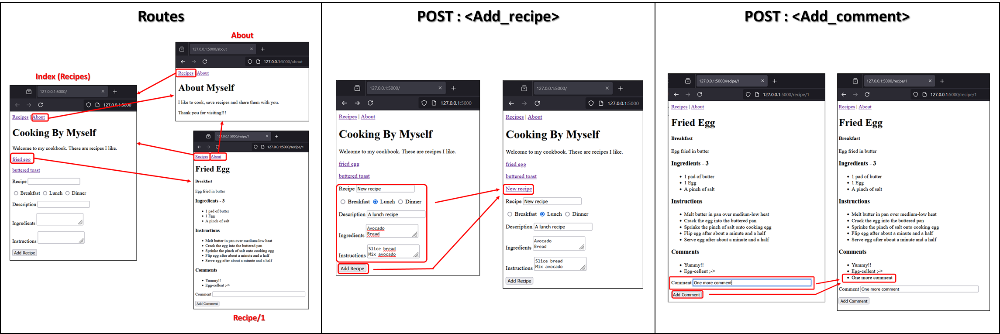

# Quick Start
* Clone the repository
* Create a virtual environment from root (`python -m venv venv`)
* Activate it (`venv/Scripts/activate`)
* Install packages (`pip install -r requirements.txt`)
* Run the `app.py` file (`python sources/cooking-by-myself_2/app.py`)

# Description
Little project to start to learn `Flask` framework.
Only three files type are used :
* app.py - contains 3 routes
* helper.py - mock the data
* forms.py - contains forms for `Flask`
* *.html - contains the `Jinja` templates (`HTML` files)

# Overview

# Available routes
* `@app.route('/')`
* `@app.route('/about')`
* `@app.route('/recipe/<int:id>')`

# Concepts learned
* `Flask` - `HTTP` request allowing -> `@app.route("/", methods=["GET", "POST"])`
* `Flask` - route selection -> `url_for('route')` / `{{ url_for('route') }}`
* `Flask` - form creation with `FlaskForm` class -> `class MyForm(FlaskForm)`
* `Jinja` - use of `FlaskForm` -> `{{ my_Form.my_field() }}`
* `Flask` - data acquisition from the `FlaskForm` -> `my_Form.my_field.data`
* `Flask` - form validation -> `validators=[DataRequired()]` / `my_form.validate_on_submit()`
* `Flask` - route redirection -> `redirect(url_for("new_route", _external=True, _scheme='https'))`